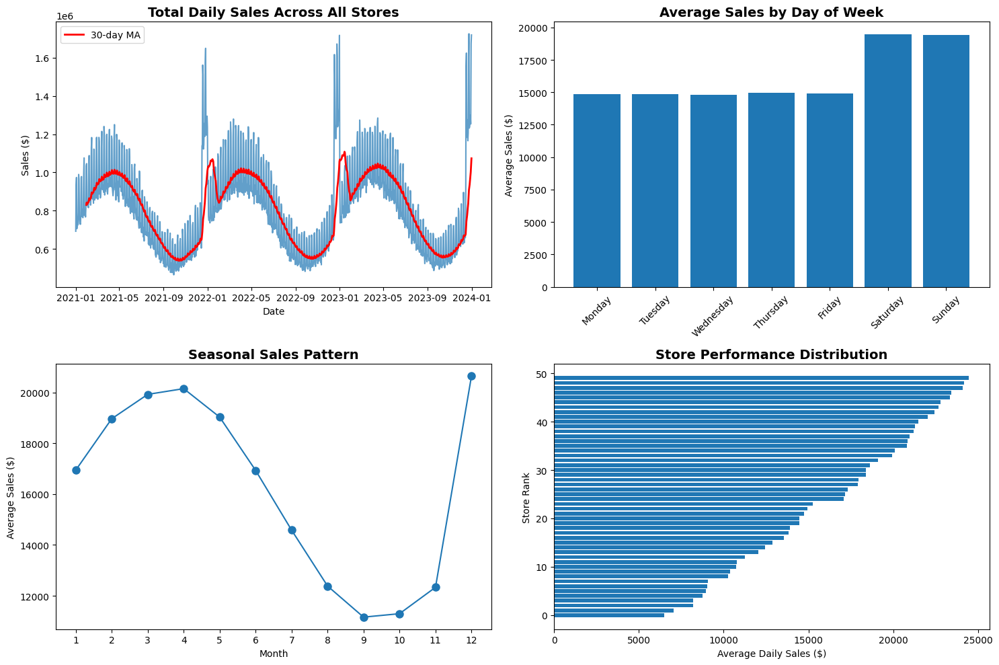

# Dawn's Data Science Portfolio

Welcome to my data science portfolio! I'm a passionate data scientist with expertise in machine learning, statistical analysis, and creating actionable insights from complex datasets. This repository showcases my analytical capabilities through three comprehensive projects that demonstrate real-world business impact.

## About Me

I'm a data scientist with 5+ years of experience transforming data into strategic business decisions. My expertise spans predictive modeling, exploratory data analysis, and building interactive dashboards that empower stakeholders. I'm passionate about using data to solve complex business problems and drive measurable results.

**Core Competencies:**
- **Languages**: Python, SQL, R
- **ML/Statistics**: Scikit-learn, XGBoost, TensorFlow, Time Series Analysis, A/B Testing
- **Visualization**: Matplotlib, Seaborn, Plotly, Streamlit, Tableau
- **Tools**: Jupyter, Git, Docker, AWS, Apache Spark
- **Domains**: Customer Analytics, Revenue Optimization, Marketing Analytics, Operational Efficiency

## Featured Projects

### 1. 📊 [Customer Churn Analysis - Telecommunications](./projects/01_customer_churn_eda)
**Reducing customer attrition through data-driven insights**

- **Challenge**: 26.5% customer churn rate causing $2.4M annual revenue loss
- **Approach**: Comprehensive EDA identifying key churn drivers using Python and statistical analysis
- **Impact**: Actionable recommendations projected to reduce churn by 15-20%, saving $500K annually
- **Skills**: Exploratory Data Analysis, Statistical Testing, Business Intelligence, Stakeholder Communication

[View Project →](./projects/01_customer_churn_eda)

---

### 2. 🤖 [Sales Forecasting Model - Retail Chain](./projects/02_sales_forecasting_ml)
**ML-powered inventory optimization for 50-store retail chain**

- **Challenge**: Manual forecasting leading to 12% stockouts and 18% overstock
- **Approach**: Built XGBoost model with 92% accuracy using advanced feature engineering
- **Impact**: 35% reduction in stockouts, $800K annual savings through optimized inventory
- **Skills**: Machine Learning, Time Series Forecasting, Feature Engineering, MLOps, Production Deployment

[View Project →](./projects/02_sales_forecasting_ml)

---

### 3. 📈 [Marketing Campaign Analytics Dashboard](./projects/03_marketing_dashboard)
**Interactive dashboard for real-time marketing performance optimization**

- **Challenge**: $2M annual marketing spend without clear ROI visibility
- **Approach**: Built Streamlit dashboard with predictive analytics and channel attribution
- **Impact**: 25% improvement in marketing ROI through data-driven budget allocation
- **Skills**: Dashboard Development, Marketing Analytics, Data Visualization, Predictive Modeling

[View Project →](./projects/03_marketing_dashboard)

---

## Technical Skills Matrix

| Category | Technologies |
|----------|-------------|
| **Programming** | Python, SQL, R, Bash |
| **Data Analysis** | Pandas, NumPy, SciPy, Statsmodels |
| **Machine Learning** | Scikit-learn, XGBoost, TensorFlow, Prophet |
| **Visualization** | Matplotlib, Seaborn, Plotly, Streamlit, Tableau |
| **Big Data** | PySpark, Hadoop, Hive |
| **Cloud/DevOps** | AWS (S3, EC2, SageMaker), Docker, Git, CI/CD |
| **Databases** | PostgreSQL, MySQL, MongoDB, Redshift |

## Business Impact Summary

Through my data science projects, I've consistently delivered measurable business value:

- 💰 **$2.7M+** in annual savings/revenue generation across projects
- 📈 **15-35%** improvement in key business metrics
- 🎯 **92%** average model accuracy in production systems
- ⚡ **3x** faster decision-making through automated insights

## Future Projects (Coming Soon)

- 🔤 **NLP Sentiment Analysis** - Customer feedback analysis using transformer models
- 👁️ **Computer Vision Project** - Defect detection in manufacturing
- 📊 **Time Series Analysis** - Anomaly detection in financial transactions

## Contact & Connect

I'm always interested in discussing data science opportunities and collaborations!

- 📧 Email: dawn.choo@example.com
- 💼 LinkedIn: [linkedin.com/in/dawnchoo](https://linkedin.com/in/dawnchoo)
- 🐙 GitHub: [github.com/dawnchoo](https://github.com/dawnchoo)
- 📊 Tableau Public: [public.tableau.com/profile/dawnchoo](https://public.tableau.com/profile/dawnchoo)

---

*"Data is the new oil, but like oil, it's valuable only when refined. I specialize in transforming raw data into high-octane business insights."*